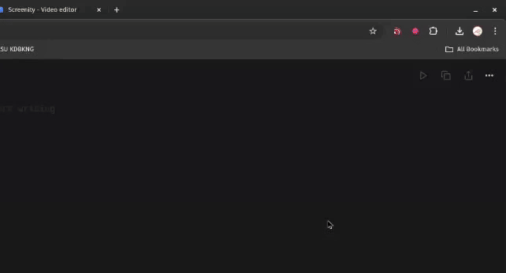

# RSS Feed Warrior

> This extension monitors RSS feeds for changes and sends notifications

A Chrome extension inspired by the collie-reader/collie repository and serving as an alternative to Feedbro, my favorite Google Chrome extension (which is no longer supported on Chrome). This extension monitors RSS feeds for changes and sends notifications.

## Features

- Add URLs to monitor for content changes
- Set custom check intervals for each URL
- Optional CSS selector to monitor specific parts of a page
- Receive notifications when content changes
- Clean and user-friendly interface

## Installation
1. Download the latest release from [GitHub](https://github.com/akbarhlubis/rss-feed-extension/releases) or clone this repository
2. Open Chrome and navigate to `chrome://extensions/`
3. Enable "Developer mode" in the top right
4. Click "Load unpacked" and select the extension directory
5. RSS Feed Warrior extension should now be installed

## Usage

1. Click on the extension icon to open the popup
2. Add a URL to monitor by filling out the form:
   - URL: The full website address to check
   - Name: A friendly name for this URL
   - Check interval: How often to check for changes (in minutes)
   - CSS Selector (optional): Specific element to check for changes
3. Click "Add URL" to start monitoring
4. You'll receive a notification when changes are detected

## License

MIT
